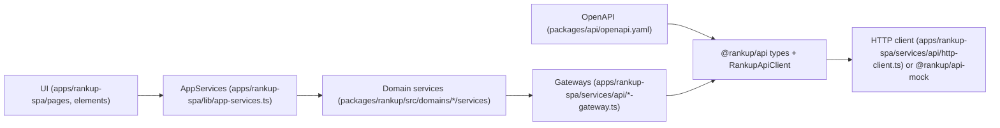

# Rankup Engine — Deep Scrutiny (Architecture, Early‑Stage)

## Purpose & Audience

Este documento es la única fuente que verá el equipo de arquitectura de VSCODE. Está diseñado para un análisis crítico, exhaustivo y técnico. Rankup Engine está en fases tempranas de desarrollo y contiene múltiples capas y capabilities todavía en estado placeholder o scaffolded. El objetivo es describir con precisión el estado real del engine, sus límites, su wiring y los riesgos de evolución para que el equipo pueda establecer juicio arquitectónico informado.

## Methodology (How this document was built)

Este README se elaboró desde la realidad del repositorio, no desde intención futura.

- Se trazó el flujo UI → AppServices → Domain Services → Gateways → RankupApiClient → HTTP/Mock.
- Se verificaron puntos de wiring y DI en `apps/rankup-spa/lib/composition-root.ts` y `apps/rankup-spa/lib/app-services.ts`.
- Se inspeccionó el pipeline OpenAPI en `packages/api/openapi.yaml`, `packages/api/src/client.ts`, y `packages/api/src/types.ts`.
- Se verificó el runtime mock en `packages/api-mock/src/index.ts`.
- Se enumeraron dominios y capabilities en `packages/rankup/src/domains/**` y se validaron tags OpenAPI.
- Se revisaron guardrails y validaciones en `scripts/repo-guardrails.ts`, `scripts/repo-ratchet.ts`, y `scripts/repo-work-log-verification.ts`.

## Business Context & Architecture Rationale

Rankup es un producto tournament‑centric, social y sin dinero real. Los usuarios compiten dentro de torneos con modos de juego definidos por reglas versionadas. El core del negocio exige separar concerns críticos para evitar acoplamientos que bloqueen la escalabilidad de modos, deportes y reglas.

Motivos principales para la arquitectura actual:

- OpenAPI‑first: los contratos HTTP son la fuente de verdad para coordinar dominios y mappers.
- Mock‑first: el producto debe correr sin backend, por lo que los mocks son runtime real.
- Guardrails estrictos: UI no puede consumir implementaciones, solo contracts tipados.
- Split por bounded contexts: separar submissions, scoring, ranked, achievements y trustSafety reduce riesgos de acoplamiento.
- Evolución multi‑sport y multi‑mode: el diseño evita mezclar reglas de scoring con flujos de torneo o con engagement.

## Maturity Legend

| Label | Meaning (práctico) |
| --- | --- |
| Implemented | Modelos, contracts, services, gateways y mocks alineados con OpenAPI. |
| Partial | Implementación funcional, pero cobertura limitada o incompleta (mínimo F0). |
| Placeholder | Solo README o carpetas vacías; sin contracts/services/gateways. |
| Scaffolded | Estructura creada (carpetas base) sin lógica funcional aún. |

## Repository Topology & Entry Points

| Path | Role |
| --- | --- |
| `apps/rankup-spa/main.ts` | Bootstrap SPA y wiring de AppServices. |
| `apps/rankup-spa/lib/composition-root.ts` | Composition root; único punto de selección mock/real. |
| `apps/rankup-spa/lib/app-services.ts` | API tipada hacia UI; contrato de consumo. |
| `apps/rankup-spa/services/api/http-client.ts` | Implementación HTTP de `RankupApiClient`. |
| `apps/rankup-spa/services/api/**` | Gateways + mappers (DTO → domain). |
| `packages/api/openapi.yaml` | Canonical OpenAPI (3.1.2). |
| `packages/api/src/client.ts` | `RankupApiClient` interface + endpoint typing. |
| `packages/api/src/types.ts` | Re-export de schemas OpenAPI. |
| `packages/api-mock/src/index.ts` | Mock runtime de `RankupApiClient`. |
| `packages/rankup/src/domains/**` | Dominios + capabilities (models/contracts/services). |
| `packages/rankup/src/{algorithms,registry,runtime,shared}` | Capas de engine fuera de dominio. |

## Layering & Dependency Rules

Reglas de dependencia y límites:

- UI consume solo contracts (`packages/rankup/src/domains/**/contracts`) o shared types, nunca runtime services ni `@rankup/api`.
- Domain packages no importan `@rankup/api` ni código de app; los services dependen de gateways contractuales.
- Gateways mapean DTOs explícitamente y no pueden usar `...api*` ni `as Domain.*`.
- Composition root es el único punto de wiring y selección mock/real.
- Platform es infra-only; no debe importar SDKs de producto.
- No UI tests; solo tests de algoritmos puros cuando existan.

## DI Model & Composition Root

- `ServiceCollection` y `InstantiationService` viven en `@rankup/platform`.
- `apps/rankup-spa/lib/composition-root.ts` registra gateways concretos y llama a `register*DomainServices`.
- La selección mock/real se decide con `EnvironmentService` y `createMockRankupApiClient` vs `createRankupApiClient`.
- `apps/rankup-spa/lib/app-services.ts` resuelve servicios tipados y es el único puente permitido hacia UI.

Secuencia de wiring actual:

1. Se crea `EnvironmentService`.
2. Se elige `RankupApiClient` (mock o HTTP) según `EnvironmentService`.
3. Se instancian gateways concretos con `RankupApiClient`.
4. Se registran gateways en la colección de servicios.
5. Se invocan `register*DomainServices` para registrar services por capability.
6. `createAppServices` expone la API tipada a la UI.

## OpenAPI Contract Workflow (How we work)

- Cualquier cambio inicia en `packages/api/openapi.yaml` (OpenAPI‑first).
- El protocolo formal está en `docs/engineering/openapi-change-protocol.md`.
- `openapi-typescript` genera `packages/api/src/generated/openapi.ts`.
- `packages/api/src/types.ts` re-exporta schemas y `packages/api/src/client.ts` define el `RankupApiClient`.
- Gateways mapean DTOs hacia modelos de dominio con mappers explícitos en `apps/rankup-spa/services/api/**`.
- `packages/api-mock/src/index.ts` debe quedar en paridad con los endpoints no admin.
- `yarn openapi:lint` y `yarn openapi:check` validan el contrato y el código generado.

## Mock‑First Runtime

- `@rankup/api-mock` es el runtime por defecto en dev.
- Paridad mock es obligatoria para endpoints no admin.
- Mocks viven en `packages/api-mock/src/index.ts` y deben alinearse con OpenAPI y gateways.
- Riesgo clave: drift entre OpenAPI, gateways y mocks si no se actualizan en paralelo.

## Guardrails & Validation

| Guardrail | Enforcement |
| --- | --- |
| Decorators inline (Lit) | `scripts/repo-guardrails.ts` (`runInlineDecoratorGuardrail`) |
| Imports en una línea | `scripts/repo-guardrails.ts` (`runSingleLineImportsGuardrail`) |
| Sin líneas en blanco entre imports | `scripts/repo-guardrails.ts` (`runImportSpacingGuardrail`) |
| Gateways sin `...api*` ni `as Domain.*` | `scripts/repo-guardrails.ts` (`runGatewayMappingGuardrail`) |
| Lit CSS/HTML indentation | `scripts/repo-guardrails.ts` (`runLitCssIndentGuardrail`) |
| Structural ADR + work log | `scripts/repo-structural-adr.ts`, `scripts/repo-work-log.ts` |
| Work-log verification | `scripts/repo-work-log-verification.ts` |
| Ratchet artifact guard | `scripts/repo-ratchet.ts` |

`yarn validate` ejecuta, en este orden: `repo:guardrails`, `openapi:verify`, `typecheck:workspace`, `yarn workspace @rankup/app validate`, y `yarn clean`.

## Engine Surface Map

| Layer | Scope | Maturity |
| --- | --- | --- |
| `packages/rankup/src/algorithms` | Lógica pura (scoring/lock/tie-breakers/draft) | Scaffolded |
| `packages/rankup/src/registry` | Registro interno de modos y deportes | Scaffolded |
| `packages/rankup/src/runtime` | Orquestación cross-domain | Scaffolded |
| `packages/rankup/src/shared` | Tipos cross-domain mínimos | Partial |
| `packages/rankup/src/domains` | Bounded contexts + capabilities | Mixed |

## Domain/Capability Inventory (Complete)

| Domain | Capability | SoT | Maturity | OpenAPI tags | Key paths | Mock parity |
| --- | --- | --- | --- | --- | --- | --- |
| accounts | auth | identidad/sesiones | Implemented | `auth.*` | `packages/rankup/src/domains/accounts/auth/{models,contracts,services}`; `apps/rankup-spa/services/api/accounts/auth-gateway.ts`; `packages/rankup/src/domains/accounts/registerAccountsDomainServices.ts` | Sí |
| accounts | me | perfil/privacidad | Implemented | `users.me`, `users.me.*` | `packages/rankup/src/domains/accounts/me/{models,contracts,services}`; `apps/rankup-spa/services/api/accounts/me-gateway.ts`; `registerAccountsDomainServices.ts` | Sí |
| accounts | users | directorio/historial | Implemented | `users`, `users.directory`, `users.history` | `packages/rankup/src/domains/accounts/users/{models,contracts,services}`; `apps/rankup-spa/services/api/accounts/users-gateway.ts`; `registerAccountsDomainServices.ts` | Sí |
| accounts | social | grafo social | Implemented | `social.*` | `packages/rankup/src/domains/accounts/social/{models,contracts,services}`; `apps/rankup-spa/services/api/accounts/social-gateway.ts`; `registerAccountsDomainServices.ts` | Sí |
| sports | catalog | catálogo deportivo | Implemented | `sports.catalog` | `packages/rankup/src/domains/sports/catalog/{models,contracts,services}`; `apps/rankup-spa/services/api/sports/sports-catalog-gateway.ts`; `registerSportsDomainServices.ts` | Sí |
| sports | schedule | calendario deportivo | Implemented | `sports.schedule` | `packages/rankup/src/domains/sports/schedule/{models,contracts,services}`; `apps/rankup-spa/services/api/sports/sports-schedule-gateway.ts`; `registerSportsDomainServices.ts` | Sí |
| rules | gameModes | modos de juego | Implemented | `game.modes` | `packages/rankup/src/domains/rules/gameModes/{models,contracts,services}`; `apps/rankup-spa/services/api/rules/game-modes-gateway.ts`; `registerRulesDomainServices.ts` | Sí |
| rules | rulesets | reglas versionadas | Implemented | `game.rulesets` | `packages/rankup/src/domains/rules/rulesets/{models,contracts,services}`; `apps/rankup-spa/services/api/rules/rulesets-gateway.ts`; `registerRulesDomainServices.ts` | Sí |
| tournaments | core | lifecycle + list/create/get | Implemented | `tournaments`, `tournaments.core`, `tournaments.lifecycle` | `packages/rankup/src/domains/tournaments/core/{models,contracts,services,validation}`; `apps/rankup-spa/services/api/tourney/tourney-core-gateway.ts`; `registerTourneyDomainServices.ts` | Sí |
| tournaments | matchdays | navegación jornadas | Implemented | `tournaments.matchdays` | `packages/rankup/src/domains/tournaments/matchdays/{models,contracts,services}`; `apps/rankup-spa/services/api/tourney/tourney-matchdays-gateway.ts`; `registerTourneyDomainServices.ts` | Sí |
| tournaments | members | membresía/roles | Implemented | `tournaments.members` | `packages/rankup/src/domains/tournaments/members/{models,contracts,services}`; `apps/rankup-spa/services/api/tourney/tourney-members-gateway.ts`; `registerTourneyDomainServices.ts` | Sí |
| tournaments | codes | invitation codes | Implemented | `tournaments.invitationCodes` | `packages/rankup/src/domains/tournaments/codes/{models,contracts,services}`; `apps/rankup-spa/services/api/tourney/tourney-invitation-codes-gateway.ts`; `registerTourneyDomainServices.ts` | Sí |
| tournaments | invites | direct invites + inbox | Implemented | `tournaments.invites`, `me.tournamentInvites` | `packages/rankup/src/domains/tournaments/invites/{models,contracts,services}`; `apps/rankup-spa/services/api/tourney/tourney-invites-gateway.ts`; `registerTourneyDomainServices.ts` | Sí |
| tournaments | preview | preview surface | Placeholder | `tournaments.preview` | `packages/rankup/src/domains/tournaments/preview/README.md` | No |
| submissions | scorePrediction | submissions por jornada | Implemented | `tournaments.submissions` | `packages/rankup/src/domains/submissions/scorePrediction/{models,contracts,services}`; `apps/rankup-spa/services/api/submissions/tourney-submissions-gateway.ts`; `registerSubmissionsDomainServices.ts` | Sí |
| scoring | ranking | rankings + windows | Implemented | `tournaments.rankings` | `packages/rankup/src/domains/scoring/ranking/{models,contracts,services}`; `apps/rankup-spa/services/api/tourney/tourney-ranking-gateway.ts`; `registerScoringDomainServices.ts` | Sí |
| scoring | results | resultados/snapshots | Placeholder | `tournaments.results` | `packages/rankup/src/domains/scoring/results/README.md` | No |
| scoring | timeline | deltas de ranking | Placeholder | N/A | `packages/rankup/src/domains/scoring/timeline/README.md` | No |
| engagement | chat | chat + moderación | Implemented | `tournaments.chat`, `tournaments.chatModeration` | `packages/rankup/src/domains/engagement/chat/{models,contracts,services}`; `apps/rankup-spa/services/api/engagement/tourney-chat-gateway.ts`; `registerEngagementDomainServices.ts` | Sí |
| engagement | live | notificaciones/feed | Implemented | `live.notifications`, `live.feed`, `tournaments.live` | `packages/rankup/src/domains/engagement/live/{models,contracts,services}`; `apps/rankup-spa/services/api/engagement/live-gateway.ts`; `registerEngagementDomainServices.ts` | Sí |
| engagement | updates | SSE/streaming | Implemented | `live.stream` | `packages/rankup/src/domains/engagement/updates/{models,contracts,services}`; `apps/rankup-spa/services/api/engagement/updates-gateway.ts`; `registerEngagementDomainServices.ts` | Sí |
| engagement | stats | snapshots | Partial | `stats.me`, `stats.users`, `stats.tournaments` | `packages/rankup/src/domains/engagement/stats/{models,contracts,services}`; `apps/rankup-spa/services/api/engagement/stats-gateway.ts`; `registerEngagementDomainServices.ts` | Sí |
| engagement | recaps | recaps/wrapped | Implemented | `stats.recaps` | `packages/rankup/src/domains/engagement/recaps/{models,contracts,services}`; `apps/rankup-spa/services/api/engagement/recaps-gateway.ts`; `registerEngagementDomainServices.ts` | Sí |
| verified | hub | hub verificado | Implemented | `verified.hub` | `packages/rankup/src/domains/verified/hub/{models,contracts,services}`; `apps/rankup-spa/services/api/verified/verified-hub-gateway.ts`; `registerVerifiedDomainServices.ts` | Sí |
| verified | events | eventos verificados | Implemented | `verified.events` | `packages/rankup/src/domains/verified/events/{models,contracts,services}`; `apps/rankup-spa/services/api/verified/verified-events-gateway.ts`; `registerVerifiedDomainServices.ts` | Sí |
| verified | tournaments | attachments verificados | Placeholder | `verified.tournaments` | N/A (no capability folder) | No |
| ranked | seasons | meta/tracks/seasons | Implemented | `ranked.meta`, `ranked.tracks`, `ranked.seasons` | `packages/rankup/src/domains/ranked/seasons/{models,contracts,services}`; `apps/rankup-spa/services/api/ranked/ranked-seasons-gateway.ts`; `registerRankedDomainServices.ts` | Sí |
| ranked | leaderboards | leaderboards + me/users | Implemented | `ranked.leaderboards`, `ranked.me`, `ranked.users` | `packages/rankup/src/domains/ranked/leaderboards/{models,contracts,services}`; `apps/rankup-spa/services/api/ranked/ranked-leaderboards-gateway.ts`; `registerRankedDomainServices.ts` | Sí |
| achievements | catalog | definiciones/meta | Implemented | `achievements`, `achievements.meta` | `packages/rankup/src/domains/achievements/catalog/{models,contracts,services}`; `apps/rankup-spa/services/api/achievements/achievements-catalog-gateway.ts`; `registerAchievementsDomainServices.ts` | Sí |
| achievements | grants | my/user achievements | Implemented | `achievements.me`, `achievements.users` | `packages/rankup/src/domains/achievements/grants/{models,contracts,services}`; `apps/rankup-spa/services/api/achievements/achievements-grants-gateway.ts`; `registerAchievementsDomainServices.ts` | Sí |
| media | uploads | sesiones de upload | Implemented | `uploads.uploads` | `packages/rankup/src/domains/media/uploads/{models,contracts,services}`; `apps/rankup-spa/services/api/media/media-uploads-gateway.ts`; `registerMediaDomainServices.ts` | Sí |
| media | assets | media registry | Implemented | `uploads.media` | `packages/rankup/src/domains/media/assets/{models,contracts,services}`; `apps/rankup-spa/services/api/media/media-assets-gateway.ts`; `registerMediaDomainServices.ts` | Sí |
| trustSafety | policies | políticas | Implemented | `trustSafety.policies` | `packages/rankup/src/domains/trustSafety/shared/{models,contracts,services}`; `apps/rankup-spa/services/api/trustSafety/trust-policies-gateway.ts`; `registerTrustSafetyDomainServices.ts` | Sí |
| trustSafety | reports | reports + blocks | Implemented | `trustSafety.reporting`, `trustSafety.blocks` | `packages/rankup/src/domains/trustSafety/reports/{models,contracts,services}`; `apps/rankup-spa/services/api/trustSafety/trust-reports-gateway.ts`; `registerTrustSafetyDomainServices.ts` | Sí |
| trustSafety | enforcement | enforcement status | Implemented | `trustSafety.enforcement` | `packages/rankup/src/domains/trustSafety/enforcement/{models,contracts,services}`; `apps/rankup-spa/services/api/trustSafety/trust-enforcement-gateway.ts`; `registerTrustSafetyDomainServices.ts` | Sí |
| trustSafety | appeals | appeals | Implemented | `trustSafety.enforcement` | `packages/rankup/src/domains/trustSafety/appeals/{models,contracts,services}`; `apps/rankup-spa/services/api/trustSafety/trust-appeals-gateway.ts`; `registerTrustSafetyDomainServices.ts` | Sí |
| promotions | campaigns | catálogo + participación | Implemented | `promotions.catalog`, `promotions.participation` | `packages/rankup/src/domains/promotions/campaigns/{models,contracts,services}`; `apps/rankup-spa/services/api/promotions/promotions-campaigns-gateway.ts`; `registerPromotionsDomainServices.ts` | Sí |
| promotions | rewards | rewards/grants | Implemented | `promotions.rewards` | `packages/rankup/src/domains/promotions/rewards/{models,contracts,services}`; `apps/rankup-spa/services/api/promotions/promotions-rewards-gateway.ts`; `registerPromotionsDomainServices.ts` | Sí |
| creators | directory | perfiles | Implemented | `creators.directory` | `packages/rankup/src/domains/creators/directory/{models,contracts,services}`; `apps/rankup-spa/services/api/creators/creators-directory-gateway.ts`; `registerCreatorsDomainServices.ts` | Sí |
| creators | catalog | hub/collections | Implemented | `creators.catalog` | `packages/rankup/src/domains/creators/catalog/{models,contracts,services}`; `apps/rankup-spa/services/api/creators/creators-catalog-gateway.ts`; `registerCreatorsDomainServices.ts` | Sí |
| admin | overlay | staff-only | Placeholder | `admin.*` | `packages/rankup/src/domains/admin/README.md` | No |

## Domain-by-Domain Narrative Walkthrough

### accounts

El dominio accounts encapsula identidad, sesiones, perfil y grafo social. Se separa para mantener el core del torneo libre de concerns de identidad y privacidad. El SoT lógico es el usuario y sus relaciones; otros dominios consumen solo summary types. En OpenAPI corresponde a `auth.*`, `users.*` y `social.*`.

### sports

sports es un ACL entre el provider externo y el dominio. Existe para evitar contaminar modelos internos con detalles de proveedores. El SoT es el catálogo normalizado (sports, competitions, seasons, matchdays). OpenAPI: `sports.catalog` y `sports.schedule`.

### rules

rules encapsula los game modes y los rulesets versionados. La intención es que scoring y submissions consuman reglas, nunca las dupliquen. OpenAPI: `game.modes` y `game.rulesets`.

### tournaments

tournaments es el core del producto. El SoT cubre lifecycle, membresía, roles y navegación de jornadas. La arquitectura fuerza que otros dominios consuman IDs y previews sin tomar ownership de membership. OpenAPI: `tournaments.*`.

### submissions

submissions representa acciones de usuario en jornadas (ej. ScorePrediction). Se separa para evitar mezclar input del usuario con scoring y ranking. OpenAPI: `tournaments.submissions`.

### scoring

scoring es el SoT de rankings y resultados. Rankings están implementados; results y timeline siguen placeholders. Esta separación previene que engagement o ranked construyan resultados “por su cuenta”. OpenAPI: `tournaments.rankings`, `tournaments.results`.

### engagement

engagement incluye chat, live feed, stats y recaps. Está diseñado como dominio derivado, consumiendo snapshots de scoring y datos de tournaments. Live y updates cubren notificaciones y SSE. OpenAPI: `tournaments.chat*`, `live.*`, `stats.*`.

### verified

verified modela contenido verificado y su hub. Está separado porque actúa como gate para ranked, achievements y promociones. OpenAPI: `verified.hub`, `verified.events`, `verified.tournaments` (gap actual).

### ranked

ranked es un dominio independiente del scoring estándar. Maneja tracks/seasons y leaderboards verificados. Consumen scoring como input, pero no lo duplican. OpenAPI: `ranked.*`.

### achievements

achievements gestiona definiciones y grants con evidencia. Debe permanecer separado de scoring para evitar coupling de reglas de puntos con progresión. OpenAPI: `achievements.*`.

### media

media provee uploads y assets con estados de moderación. Es transversal y alimenta branding, verified y creators. OpenAPI: `uploads.*`.

### trustSafety

trustSafety define políticas, reports, enforcement y appeals. Es un dominio transversal que impone restricciones pero no es owned por otros dominios. OpenAPI: `trustSafety.*`.

### promotions

promotions representa campañas oficiales, opt‑ins y rewards. Se separa para aislar flujo de rewards y fulfillment. OpenAPI: `promotions.*`.

### creators

creators modela perfiles públicos y catálogos/colecciones. Se separa para evitar que verified o media asuman ownership de identidad de creador. OpenAPI: `creators.*`.

### admin

admin es overlay staff‑only y no es SoT. Existe en OpenAPI, pero el dominio aún es placeholder.

## Delta vs Partitioning Proposal

- La propuesta de partición está implementada en la mayoría de dominios, adelantando fases 1 y 2.
- Engagement recaps/updates ya se separaron en capabilities dedicadas, pero OpenAPI aún usa tags `stats.*` y `live.*`.
- `scoring/results`, `scoring/timeline`, `tournaments/preview`, y `verified.tournaments` siguen en estado placeholder.
- `algorithms/registry/runtime` están scaffolded, sin lógica ejecutable ni tests de reglas.

## Risks & Gaps (Descriptive, Early‑Stage Focus)

- Capas base del engine (`algorithms/registry/runtime`) sin implementación real todavía.
- Falta de capabilities para `tournaments.results` y `scoring.timeline` pese a estar en OpenAPI.
- `tournaments.preview` y `verified.tournaments` no están modelados en el dominio.
- `admin.*` existe en OpenAPI pero no tiene dominio ni mocks.
- Alto riesgo de drift entre OpenAPI, gateways y mocks si no se actualizan juntos.

TREECLIP:
/rankup
├── README.md
├── package.json
├── src
│   ├── algorithms
│   │   ├── README.md
│   │   ├── draft
│   │   │   └── README.md
│   │   ├── lockRules
│   │   │   └── README.md
│   │   ├── scoring
│   │   │   └── README.md
│   │   └── tieBreakers
│   │       └── README.md
│   ├── domains
│   │   ├── accounts
│   │   │   ├── README.md
│   │   │   ├── auth
│   │   │   │   ├── README.md
│   │   │   │   ├── contracts
│   │   │   │   │   ├── auth.ts
│   │   │   │   │   ├── authGateway.ts
│   │   │   │   │   └── types.ts
│   │   │   │   ├── models
│   │   │   │   │   ├── auth.ts
│   │   │   │   │   └── index.ts
│   │   │   │   └── services
│   │   │   │       └── authService.ts
│   │   │   ├── index.ts
│   │   │   ├── me
│   │   │   │   ├── README.md
│   │   │   │   ├── contracts
│   │   │   │   │   ├── me.ts
│   │   │   │   │   ├── meGateway.ts
│   │   │   │   │   └── types.ts
│   │   │   │   ├── models
│   │   │   │   │   ├── index.ts
│   │   │   │   │   └── me.ts
│   │   │   │   └── services
│   │   │   │       └── meService.ts
│   │   │   ├── registerAccountsDomainServices.ts
│   │   │   ├── shared
│   │   │   │   ├── README.md
│   │   │   │   └── models
│   │   │   │       ├── enums.ts
│   │   │   │       ├── ids.ts
│   │   │   │       ├── index.ts
│   │   │   │       └── user.ts
│   │   │   ├── social
│   │   │   │   ├── README.md
│   │   │   │   ├── contracts
│   │   │   │   │   ├── social.ts
│   │   │   │   │   ├── socialGateway.ts
│   │   │   │   │   └── types.ts
│   │   │   │   ├── models
│   │   │   │   │   ├── index.ts
│   │   │   │   │   └── social.ts
│   │   │   │   └── services
│   │   │   │       └── socialService.ts
│   │   │   └── users
│   │   │       ├── README.md
│   │   │       ├── contracts
│   │   │       │   ├── types.ts
│   │   │       │   ├── users.ts
│   │   │       │   └── usersGateway.ts
│   │   │       ├── models
│   │   │       │   ├── index.ts
│   │   │       │   └── users.ts
│   │   │       └── services
│   │   │           └── usersService.ts
│   │   ├── achievements
│   │   │   ├── README.md
│   │   │   ├── catalog
│   │   │   │   ├── README.md
│   │   │   │   ├── contracts
│   │   │   │   │   ├── achievementsCatalog.ts
│   │   │   │   │   ├── achievementsCatalogGateway.ts
│   │   │   │   │   └── types.ts
│   │   │   │   ├── models
│   │   │   │   │   ├── catalog.ts
│   │   │   │   │   └── index.ts
│   │   │   │   └── services
│   │   │   │       └── achievementsCatalogService.ts
│   │   │   ├── grants
│   │   │   │   ├── README.md
│   │   │   │   ├── contracts
│   │   │   │   │   ├── achievementsGrants.ts
│   │   │   │   │   ├── achievementsGrantsGateway.ts
│   │   │   │   │   └── types.ts
│   │   │   │   ├── models
│   │   │   │   │   ├── grants.ts
│   │   │   │   │   └── index.ts
│   │   │   │   └── services
│   │   │   │       └── achievementsGrantsService.ts
│   │   │   ├── index.ts
│   │   │   ├── registerAchievementsDomainServices.ts
│   │   │   └── shared
│   │   │       ├── README.md
│   │   │       └── models
│   │   │           ├── achievements.ts
│   │   │           ├── enums.ts
│   │   │           ├── ids.ts
│   │   │           └── index.ts
│   │   ├── admin
│   │   │   ├── README.md
│   │   │   ├── ops
│   │   │   │   └── README.md
│   │   │   └── shared
│   │   │       └── README.md
│   │   ├── creators
│   │   │   ├── README.md
│   │   │   ├── catalog
│   │   │   │   ├── README.md
│   │   │   │   ├── contracts
│   │   │   │   │   ├── creatorsCatalog.ts
│   │   │   │   │   ├── creatorsCatalogGateway.ts
│   │   │   │   │   └── types.ts
│   │   │   │   ├── models
│   │   │   │   │   ├── catalog.ts
│   │   │   │   │   └── index.ts
│   │   │   │   └── services
│   │   │   │       └── creatorsCatalogService.ts
│   │   │   ├── directory
│   │   │   │   ├── README.md
│   │   │   │   ├── contracts
│   │   │   │   │   ├── creatorsDirectory.ts
│   │   │   │   │   ├── creatorsDirectoryGateway.ts
│   │   │   │   │   └── types.ts
│   │   │   │   ├── models
│   │   │   │   │   ├── directory.ts
│   │   │   │   │   └── index.ts
│   │   │   │   └── services
│   │   │   │       └── creatorsDirectoryService.ts
│   │   │   ├── index.ts
│   │   │   ├── registerCreatorsDomainServices.ts
│   │   │   └── shared
│   │   │       ├── README.md
│   │   │       └── models
│   │   │           ├── creators.ts
│   │   │           ├── enums.ts
│   │   │           ├── ids.ts
│   │   │           └── index.ts
│   │   ├── engagement
│   │   │   ├── README.md
│   │   │   ├── chat
│   │   │   │   ├── README.md
│   │   │   │   ├── contracts
│   │   │   │   │   ├── tourneyChat.ts
│   │   │   │   │   ├── tourneyChatGateway.ts
│   │   │   │   │   └── types.ts
│   │   │   │   ├── models
│   │   │   │   │   ├── chat.ts
│   │   │   │   │   └── index.ts
│   │   │   │   └── services
│   │   │   │       └── tourneyChatService.ts
│   │   │   ├── index.ts
│   │   │   ├── live
│   │   │   │   ├── README.md
│   │   │   │   ├── contracts
│   │   │   │   │   ├── live.ts
│   │   │   │   │   ├── liveGateway.ts
│   │   │   │   │   └── types.ts
│   │   │   │   ├── models
│   │   │   │   │   ├── index.ts
│   │   │   │   │   └── live.ts
│   │   │   │   └── services
│   │   │   │       └── liveService.ts
│   │   │   ├── recaps
│   │   │   │   ├── README.md
│   │   │   │   ├── contracts
│   │   │   │   │   ├── recaps.ts
│   │   │   │   │   ├── recapsGateway.ts
│   │   │   │   │   └── types.ts
│   │   │   │   ├── models
│   │   │   │   │   ├── index.ts
│   │   │   │   │   └── recaps.ts
│   │   │   │   └── services
│   │   │   │       └── recapsService.ts
│   │   │   ├── registerEngagementDomainServices.ts
│   │   │   ├── shared
│   │   │   │   ├── README.md
│   │   │   │   └── models
│   │   │   │       ├── feed.ts
│   │   │   │       ├── ids.ts
│   │   │   │       ├── index.ts
│   │   │   │       ├── notifications.ts
│   │   │   │       ├── recap.ts
│   │   │   │       └── user.ts
│   │   │   ├── stats
│   │   │   │   ├── README.md
│   │   │   │   ├── contracts
│   │   │   │   │   ├── stats.ts
│   │   │   │   │   ├── statsGateway.ts
│   │   │   │   │   └── types.ts
│   │   │   │   ├── models
│   │   │   │   │   ├── index.ts
│   │   │   │   │   └── stats.ts
│   │   │   │   └── services
│   │   │   │       └── statsService.ts
│   │   │   └── updates
│   │   │       ├── README.md
│   │   │       ├── contracts
│   │   │       │   ├── types.ts
│   │   │       │   ├── updates.ts
│   │   │       │   └── updatesGateway.ts
│   │   │       ├── models
│   │   │       │   ├── index.ts
│   │   │       │   └── updates.ts
│   │   │       └── services
│   │   │           └── updatesService.ts
│   │   ├── media
│   │   │   ├── README.md
│   │   │   ├── assets
│   │   │   │   ├── README.md
│   │   │   │   ├── contracts
│   │   │   │   │   ├── mediaAssets.ts
│   │   │   │   │   ├── mediaAssetsGateway.ts
│   │   │   │   │   └── types.ts
│   │   │   │   ├── models
│   │   │   │   │   ├── assets.ts
│   │   │   │   │   └── index.ts
│   │   │   │   └── services
│   │   │   │       └── mediaAssetsService.ts
│   │   │   ├── index.ts
│   │   │   ├── registerMediaDomainServices.ts
│   │   │   ├── shared
│   │   │   │   ├── README.md
│   │   │   │   └── models
│   │   │   │       ├── enums.ts
│   │   │   │       ├── ids.ts
│   │   │   │       ├── index.ts
│   │   │   │       └── media.ts
│   │   │   └── uploads
│   │   │       ├── README.md
│   │   │       ├── contracts
│   │   │       │   ├── mediaUploads.ts
│   │   │       │   ├── mediaUploadsGateway.ts
│   │   │       │   └── types.ts
│   │   │       ├── models
│   │   │       │   ├── index.ts
│   │   │       │   └── uploads.ts
│   │   │       └── services
│   │   │           └── mediaUploadsService.ts
│   │   ├── promotions
│   │   │   ├── README.md
│   │   │   ├── campaigns
│   │   │   │   ├── README.md
│   │   │   │   ├── contracts
│   │   │   │   │   ├── promotionsCampaigns.ts
│   │   │   │   │   ├── promotionsCampaignsGateway.ts
│   │   │   │   │   └── types.ts
│   │   │   │   ├── models
│   │   │   │   │   ├── campaigns.ts
│   │   │   │   │   └── index.ts
│   │   │   │   └── services
│   │   │   │       └── promotionsCampaignsService.ts
│   │   │   ├── index.ts
│   │   │   ├── registerPromotionsDomainServices.ts
│   │   │   ├── rewards
│   │   │   │   ├── README.md
│   │   │   │   ├── contracts
│   │   │   │   │   ├── promotionsRewards.ts
│   │   │   │   │   ├── promotionsRewardsGateway.ts
│   │   │   │   │   └── types.ts
│   │   │   │   ├── models
│   │   │   │   │   ├── index.ts
│   │   │   │   │   └── rewards.ts
│   │   │   │   └── services
│   │   │   │       └── promotionsRewardsService.ts
│   │   │   └── shared
│   │   │       ├── README.md
│   │   │       └── models
│   │   │           ├── enums.ts
│   │   │           ├── ids.ts
│   │   │           ├── index.ts
│   │   │           └── promotions.ts
│   │   ├── ranked
│   │   │   ├── README.md
│   │   │   ├── index.ts
│   │   │   ├── leaderboards
│   │   │   │   ├── README.md
│   │   │   │   ├── contracts
│   │   │   │   │   ├── rankedLeaderboards.ts
│   │   │   │   │   ├── rankedLeaderboardsGateway.ts
│   │   │   │   │   └── types.ts
│   │   │   │   ├── models
│   │   │   │   │   ├── index.ts
│   │   │   │   │   └── leaderboards.ts
│   │   │   │   └── services
│   │   │   │       └── rankedLeaderboardsService.ts
│   │   │   ├── registerRankedDomainServices.ts
│   │   │   ├── seasons
│   │   │   │   ├── README.md
│   │   │   │   ├── contracts
│   │   │   │   │   ├── rankedSeasons.ts
│   │   │   │   │   ├── rankedSeasonsGateway.ts
│   │   │   │   │   └── types.ts
│   │   │   │   ├── models
│   │   │   │   │   ├── index.ts
│   │   │   │   │   └── seasons.ts
│   │   │   │   └── services
│   │   │   │       └── rankedSeasonsService.ts
│   │   │   └── shared
│   │   │       ├── README.md
│   │   │       └── models
│   │   │           ├── enums.ts
│   │   │           ├── ids.ts
│   │   │           ├── index.ts
│   │   │           └── ranked.ts
│   │   ├── rules
│   │   │   ├── README.md
│   │   │   ├── gameModes
│   │   │   │   ├── README.md
│   │   │   │   ├── contracts
│   │   │   │   │   ├── gameModes.ts
│   │   │   │   │   ├── gameModesGateway.ts
│   │   │   │   │   └── types.ts
│   │   │   │   ├── models
│   │   │   │   │   ├── gameMode.ts
│   │   │   │   │   └── index.ts
│   │   │   │   └── services
│   │   │   │       └── gameModesService.ts
│   │   │   ├── index.ts
│   │   │   ├── registerRulesDomainServices.ts
│   │   │   ├── rulesets
│   │   │   │   ├── README.md
│   │   │   │   ├── contracts
│   │   │   │   │   ├── rulesets.ts
│   │   │   │   │   ├── rulesetsGateway.ts
│   │   │   │   │   └── types.ts
│   │   │   │   ├── models
│   │   │   │   │   ├── index.ts
│   │   │   │   │   └── ruleset.ts
│   │   │   │   └── services
│   │   │   │       └── rulesetsService.ts
│   │   │   └── shared
│   │   │       ├── README.md
│   │   │       └── models
│   │   │           ├── enums.ts
│   │   │           ├── ids.ts
│   │   │           └── index.ts
│   │   ├── scoring
│   │   │   ├── README.md
│   │   │   ├── index.ts
│   │   │   ├── ranking
│   │   │   │   ├── contracts
│   │   │   │   │   ├── tourneyRanking.ts
│   │   │   │   │   ├── tourneyRankingGateway.ts
│   │   │   │   │   └── types.ts
│   │   │   │   ├── models
│   │   │   │   │   ├── index.ts
│   │   │   │   │   └── ranking.ts
│   │   │   │   ├── services
│   │   │   │   │   └── tourneyRankingService.ts
│   │   │   │   └── validation
│   │   │   ├── registerScoringDomainServices.ts
│   │   │   ├── results
│   │   │   │   └── README.md
│   │   │   ├── shared
│   │   │   │   └── README.md
│   │   │   └── timeline
│   │   │       └── README.md
│   │   ├── sports
│   │   │   ├── README.md
│   │   │   ├── catalog
│   │   │   │   ├── README.md
│   │   │   │   ├── contracts
│   │   │   │   │   ├── sportsCatalog.ts
│   │   │   │   │   ├── sportsCatalogGateway.ts
│   │   │   │   │   └── types.ts
│   │   │   │   ├── models
│   │   │   │   │   ├── catalog.ts
│   │   │   │   │   └── index.ts
│   │   │   │   └── services
│   │   │   │       └── sportsCatalogService.ts
│   │   │   ├── index.ts
│   │   │   ├── registerSportsDomainServices.ts
│   │   │   ├── schedule
│   │   │   │   ├── README.md
│   │   │   │   ├── contracts
│   │   │   │   │   ├── sportsSchedule.ts
│   │   │   │   │   ├── sportsScheduleGateway.ts
│   │   │   │   │   └── types.ts
│   │   │   │   ├── models
│   │   │   │   │   ├── index.ts
│   │   │   │   │   └── schedule.ts
│   │   │   │   └── services
│   │   │   │       └── sportsScheduleService.ts
│   │   │   └── shared
│   │   │       ├── README.md
│   │   │       └── models
│   │   │           ├── enums.ts
│   │   │           ├── ids.ts
│   │   │           └── index.ts
│   │   ├── submissions
│   │   │   ├── README.md
│   │   │   ├── draft
│   │   │   │   └── README.md
│   │   │   ├── index.ts
│   │   │   ├── registerSubmissionsDomainServices.ts
│   │   │   ├── scorePrediction
│   │   │   │   ├── README.md
│   │   │   │   ├── contracts
│   │   │   │   │   ├── tourneySubmissions.ts
│   │   │   │   │   ├── tourneySubmissionsGateway.ts
│   │   │   │   │   └── types.ts
│   │   │   │   ├── models
│   │   │   │   │   ├── index.ts
│   │   │   │   │   └── submissions.ts
│   │   │   │   └── services
│   │   │   │       └── tourneySubmissionsService.ts
│   │   │   └── shared
│   │   │       ├── README.md
│   │   │       └── models
│   │   │           ├── enums.ts
│   │   │           ├── ids.ts
│   │   │           ├── index.ts
│   │   │           └── user.ts
│   │   ├── tournaments
│   │   │   ├── README.md
│   │   │   ├── codes
│   │   │   │   ├── contracts
│   │   │   │   │   ├── tourneyInvitationCodes.ts
│   │   │   │   │   ├── tourneyInvitationCodesGateway.ts
│   │   │   │   │   └── types.ts
│   │   │   │   ├── models
│   │   │   │   │   ├── index.ts
│   │   │   │   │   └── invitationCodes.ts
│   │   │   │   ├── services
│   │   │   │   │   └── tourneyInvitationCodesService.ts
│   │   │   │   └── validation
│   │   │   ├── core
│   │   │   │   ├── contracts
│   │   │   │   │   ├── tourneyCore.ts
│   │   │   │   │   ├── tourneyCoreGateway.ts
│   │   │   │   │   └── types.ts
│   │   │   │   ├── models
│   │   │   │   │   ├── index.ts
│   │   │   │   │   ├── preview.ts
│   │   │   │   │   └── tournament.ts
│   │   │   │   ├── services
│   │   │   │   │   └── tourneyCoreService.ts
│   │   │   │   └── validation
│   │   │   │       └── validateCreateTournamentRequest.ts
│   │   │   ├── fixtures
│   │   │   │   └── README.md
│   │   │   ├── index.ts
│   │   │   ├── invites
│   │   │   │   ├── contracts
│   │   │   │   │   ├── tourneyInvites.ts
│   │   │   │   │   ├── tourneyInvitesGateway.ts
│   │   │   │   │   └── types.ts
│   │   │   │   ├── models
│   │   │   │   │   ├── index.ts
│   │   │   │   │   └── invites.ts
│   │   │   │   ├── services
│   │   │   │   │   └── tourneyInvitesService.ts
│   │   │   │   └── validation
│   │   │   ├── matchdays
│   │   │   │   ├── contracts
│   │   │   │   │   ├── tourneyMatchdays.ts
│   │   │   │   │   ├── tourneyMatchdaysGateway.ts
│   │   │   │   │   └── types.ts
│   │   │   │   ├── models
│   │   │   │   │   ├── index.ts
│   │   │   │   │   └── matchday.ts
│   │   │   │   ├── services
│   │   │   │   │   └── tourneyMatchdaysService.ts
│   │   │   │   └── validation
│   │   │   ├── members
│   │   │   │   ├── contracts
│   │   │   │   │   ├── tourneyMembers.ts
│   │   │   │   │   ├── tourneyMembersGateway.ts
│   │   │   │   │   └── types.ts
│   │   │   │   ├── models
│   │   │   │   │   ├── index.ts
│   │   │   │   │   └── members.ts
│   │   │   │   ├── services
│   │   │   │   │   └── tourneyMembersService.ts
│   │   │   │   └── validation
│   │   │   ├── preview
│   │   │   │   └── README.md
│   │   │   ├── registerTourneyDomainServices.ts
│   │   │   └── shared
│   │   │       ├── index.ts
│   │   │       ├── models
│   │   │       │   ├── enums.ts
│   │   │       │   ├── ids.ts
│   │   │       │   ├── index.ts
│   │   │       │   └── user.ts
│   │   │       └── validation
│   │   │           ├── README.md
│   │   │           ├── validateInvitationCode.ts
│   │   │           └── validateMatchdayNumber.ts
│   │   ├── trustSafety
│   │   │   ├── README.md
│   │   │   ├── appeals
│   │   │   │   ├── README.md
│   │   │   │   ├── contracts
│   │   │   │   │   ├── trustAppeals.ts
│   │   │   │   │   ├── trustAppealsGateway.ts
│   │   │   │   │   └── types.ts
│   │   │   │   ├── models
│   │   │   │   │   ├── appeals.ts
│   │   │   │   │   └── index.ts
│   │   │   │   └── services
│   │   │   │       └── trustAppealsService.ts
│   │   │   ├── enforcement
│   │   │   │   ├── README.md
│   │   │   │   ├── contracts
│   │   │   │   │   ├── trustEnforcement.ts
│   │   │   │   │   ├── trustEnforcementGateway.ts
│   │   │   │   │   └── types.ts
│   │   │   │   ├── models
│   │   │   │   │   ├── enforcement.ts
│   │   │   │   │   └── index.ts
│   │   │   │   └── services
│   │   │   │       └── trustEnforcementService.ts
│   │   │   ├── index.ts
│   │   │   ├── registerTrustSafetyDomainServices.ts
│   │   │   ├── reports
│   │   │   │   ├── README.md
│   │   │   │   ├── contracts
│   │   │   │   │   ├── trustReports.ts
│   │   │   │   │   ├── trustReportsGateway.ts
│   │   │   │   │   └── types.ts
│   │   │   │   ├── models
│   │   │   │   │   ├── index.ts
│   │   │   │   │   └── reports.ts
│   │   │   │   └── services
│   │   │   │       └── trustReportsService.ts
│   │   │   └── shared
│   │   │       ├── README.md
│   │   │       ├── contracts
│   │   │       │   ├── trustPolicies.ts
│   │   │       │   ├── trustPoliciesGateway.ts
│   │   │       │   └── types.ts
│   │   │       ├── models
│   │   │       │   ├── enums.ts
│   │   │       │   ├── ids.ts
│   │   │       │   ├── index.ts
│   │   │       │   └── policies.ts
│   │   │       └── services
│   │   │           └── trustPoliciesService.ts
│   │   └── verified
│   │       ├── README.md
│   │       ├── events
│   │       │   ├── README.md
│   │       │   ├── contracts
│   │       │   │   ├── events.ts
│   │       │   │   ├── eventsGateway.ts
│   │       │   │   └── types.ts
│   │       │   ├── models
│   │       │   │   ├── events.ts
│   │       │   │   └── index.ts
│   │       │   └── services
│   │       │       └── eventsService.ts
│   │       ├── hub
│   │       │   ├── README.md
│   │       │   ├── contracts
│   │       │   │   ├── hub.ts
│   │       │   │   ├── hubGateway.ts
│   │       │   │   └── types.ts
│   │       │   ├── models
│   │       │   │   ├── hub.ts
│   │       │   │   └── index.ts
│   │       │   └── services
│   │       │       └── hubService.ts
│   │       ├── index.ts
│   │       ├── registerVerifiedDomainServices.ts
│   │       └── shared
│   │           ├── README.md
│   │           └── models
│   │               ├── enums.ts
│   │               ├── ids.ts
│   │               ├── index.ts
│   │               └── verified.ts
│   ├── registry
│   │   ├── README.md
│   │   ├── gameModes
│   │   │   └── README.md
│   │   └── sports
│   │       └── README.md
│   ├── runtime
│   │   ├── README.md
│   │   ├── game
│   │   │   └── README.md
│   │   └── tourney
│   │       └── README.md
│   └── shared
│       ├── README.md
│       ├── contracts
│       │   └── README.md
│       ├── fixtures
│       │   └── README.md
│       ├── models
│       │   └── README.md
│       └── validation
│           └── README.md
└── tsconfig.json

217 directories, 383 files
